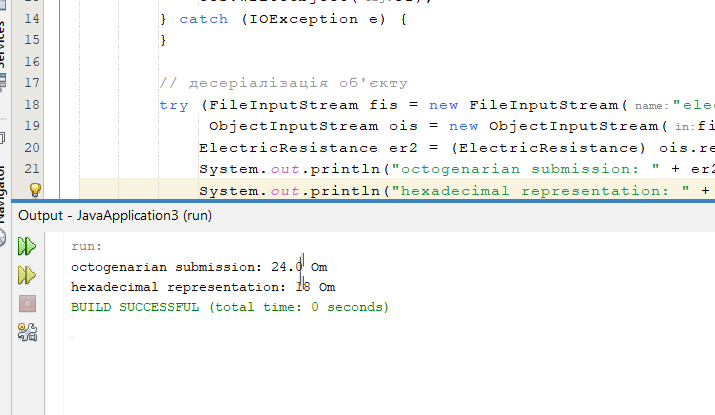
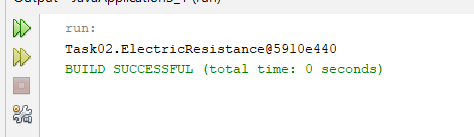

# 35_simonichenko_vladimyr
+ [TASK01](#TASK01)
+ [TASK02](#TASK02)

## TASK01:
Завдання:

Выполнить разработку простейшей консольной программы на Java,
например, выводящей на экран все аргументы командной строки, заданные
при запуске и разместить её в локальном хранилище.

#Результат запуску кода:

## TASK02:
Індивідуальне завдання:

Варіант №17 - Определить 8-ричное и 16-ричное представление целочисленного значения
общего электрического сопротивления трёх последовательно соединённых
проводников при заданном постоянном токе и известном напряжении на
каждом проводнике.

# Результат виконання програми:

**Виконання** **ElectricResistanceDemo:**

