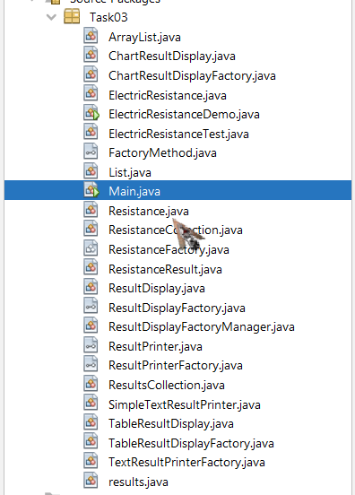

# 35_simonichenko_vladimyr

+ [TASK01](#TASK01)
+ [TASK02](#TASK02)
+ [TASK03](#TASK03)

## TASK01:
Завдання:

Выполнить разработку простейшей консольной программы на Java,
например, выводящей на экран все аргументы командной строки, заданные
при запуске и разместить её в локальном хранилище.

#Результат запуску кода:

## TASK02:
Індивідуальне завдання:

Варіант №17 - Определить 8-ричное и 16-ричное представление целочисленного значения
общего электрического сопротивления трёх последовательно соединённых
проводников при заданном постоянном токе и известном напряжении на
каждом проводнике.

# Результат виконання програми:

**Виконання** **ElectricResistanceDemo:**

## TASK03:

**Завдання:**

1. Як основа використовувати вихідний текст проекту попередньої лабораторної роботи. Забезпечити розміщення результатів обчислень уколекції з можливістю збереження/відновлення.
2. Використовуючи шаблон проектування Factory Method (Virtual Constructor), розробити ієрархію, що передбачає розширення рахунок додавання
нових відображуваних класів.
3. Розширити ієрархію інтерфейсом "фабрикованих" об'єктів, що представляє набір методів для відображення результатів обчислень.
4. Реалізувати ці методи виведення результатів у текстовому виді.
5. Розробити та реалізувати інтерфейс для "фабрикуючого" методу.

**Результат виконання завдання 💫😵💫:**

